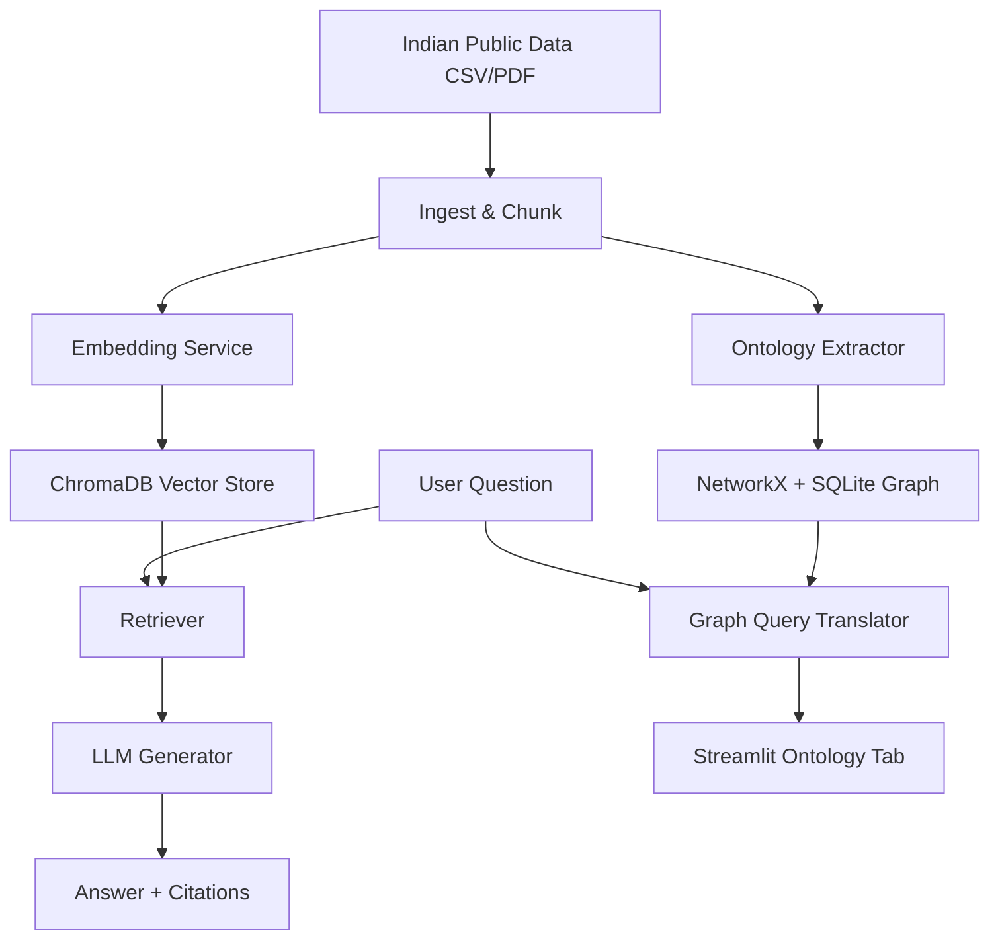

# 🇮🇳 Sovereign RAG + Ontology for Indian Public Data

Build a reproducible pipeline for ingesting, querying, and visualizing Indian public policy data using RAG and Knowledge Graphs.

## 🚀 Features

- **Phase 1: Local-first RAG**: Chunking, embedding, and storage happen locally with exact source citations.
- **Phase 2: Ontology Layer**: Automatic extraction of entities (Schemes, Ministries, Districts) and relationships.
- **Property Graph**: Stored using NetworkX + SQLite (No Docker required).
- **Natural Language Graph Queries**: "Show schemes for rural women in Odisha".
- **Interactive Visualization**: Pyvis-powered graph explorer directly in Streamlit.
- **Data Lineage**: Every node/edge traces back to the source chunk.

## 🏗️ Architecture



## 🛠️ Local Development

```bash
# Install dependencies
pip install -r requirements.txt
python -m spacy download en_core_web_sm

# Set up environment
cp .env.example .env # Add your OPENCODE_API_KEYS

# Run the app
streamlit run src/api/main.py

# Run tests
pytest
```

## 🕸️ Ontology Schema (Indian Policy)

- **Entities**: `Scheme`, `Ministry`, `District`, `State`, `Outcome`, `Beneficiary`, `Target Group`
- **Relationships**: 
    - `Ministry` --IMPLEMENTS--> `Scheme`
    - `Scheme` --TARGETS--> `Beneficiary`
    - `District` --LOCATED_IN--> `State`
    - `Scheme` --ACHIEVED--> `Outcome`

## 🚀 Deployment (Streamlit Cloud / HF Spaces)

1. Push this repo to GitHub.
2. In Streamlit Cloud, select `src/api/main.py` as the entry point.
3. Add `OPENCODE_API_KEYS` in the Secrets/Environment Variables.
4. The app will automatically install requirements and download the spaCy model.

## 📝 License

Apache 2.0
