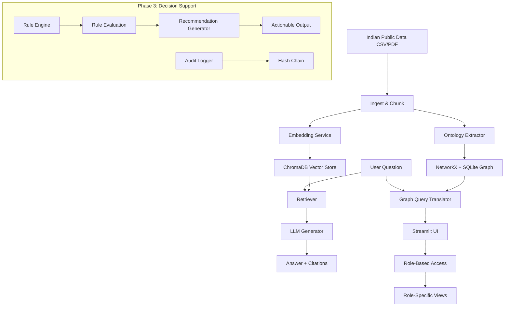

# 🇮🇳 Sovereign RAG + Ontology + Decision Support for Indian Public Data

Build a reproducible pipeline for ingesting, querying, and visualizing Indian public policy data using RAG, Knowledge Graphs, and Policy Decision Support.

## 🚀 Features

- **Phase 1: Local-first RAG**: Chunking, embedding, and storage happen locally with exact source citations.
- **Phase 2: Ontology Layer**: Automatic extraction of entities (Schemes, Ministries, Districts) and relationships.
- **Phase 3: Decision Support Layer** (NEW):
  - YAML-based rule engine for policy logic
  - Role-based access simulation (analyst, field_officer, policymaker)
  - Immutable audit log with SHA-256 hashing
  - LLM-powered recommendations with citations
  - DPDP Act 2023 compliance scaffolding
- **Property Graph**: Stored using NetworkX + SQLite (No Docker required).
- **Natural Language Graph Queries**: "Show schemes for rural women in Odisha".
- **Interactive Visualization**: Pyvis-powered graph explorer directly in Streamlit.
- **Data Lineage**: Every node/edge traces back to the source chunk.

## 🏗️ Architecture



## 🛠️ Local Development

```bash
# Install dependencies
pip install -r requirements.txt
python -m spacy download en_core_web_sm

# Set up environment
cp .env.example .env # Add your OPENCODE_API_KEYS

# Run the app
streamlit run src/api/main.py

# Run tests
pytest tests/ -v --cov=src
```

## ⚡ Rule Engine (Phase 3)

Rules are defined in YAML and evaluated against context data:

```yaml
# rules/pmay_review.yaml
rule_id: pmay_low_utilization_review
description: "Flag districts with low PMAY fund utilization for manual review"
condition:
  all:
    - entity: District
      field: pmay_utilization_percent
      operator: "<"
      value: 50
    - entity: District
      field: population
      operator: ">"
      value: 1000000
action:
  type: "flag_for_review"
  priority: "high"
  notify_roles: ["policymaker", "field_officer"]
  recommendation_prompt: |
    Based on low utilization in {district}, suggest 3 actionable interventions.
```

### Supported Operators
- Comparison: `<`, `>`, `<=`, `>=`, `==`, `!=`
- Collection: `in`, `not in`
- String: `contains`, `startswith`, `endswith`

### Condition Logic
- `all`: All conditions must be true
- `any`: At least one condition must be true
- `none`: No conditions should be true

## 🔐 Role-Based Access (Phase 3)

| Role | Permissions |
|------|-------------|
| **Analyst** | query:read, ontology:read, rules:read |
| **Field Officer** | Above + rules:flag, recommendation:request |
| **Policymaker** | Above + report:export, audit:read |
| **Admin** | Full access |

## 📋 Audit Log (Phase 3)

Every query and action is logged with:
- User role
- Timestamp
- SHA-256 query hash
- SHA-256 result hash
- Hash chain linking (tamper detection)

## ⚖️ DPDP Act 2023 Compliance (Phase 3)

| Principle | Implementation |
|-----------|---------------|
| **Purpose Limitation** | Data marked with intended purpose; access verified |
| **Data Minimization** | Only relevant fields retained per purpose |
| **Retention Policy** | Automatic deletion when purpose served or retention expires |

## 🕸️ Ontology Schema (Indian Policy)

- **Entities**: `Scheme`, `Ministry`, `District`, `State`, `Outcome`, `Beneficiary`, `Target Group`
- **Relationships**: 
    - `Ministry` --IMPLEMENTS--> `Scheme`
    - `Scheme` --TARGETS--> `Beneficiary`
    - `District` --LOCATED_IN--> `State`
    - `Scheme` --ACHIEVED--> `Outcome`

## 🚀 Deployment (Streamlit Cloud / HF Spaces)

1. Push this repo to GitHub.
2. In Streamlit Cloud, select `src/api/main.py` as the entry point.
3. Add `OPENCODE_API_KEYS` in the Secrets/Environment Variables.
4. The app will automatically install requirements and download the spaCy model.

**Note for HF Spaces**: For LLM calls in recommendations, you may need GPU-enabled spaces. Consider using:
- Streamlit Cloud (recommended for simpler apps)
- HF Spaces with T4 GPU upgrade (for LLM-heavy recommendation generation)

## 📁 Project Structure

```
src/
├── api/
│   └── main.py              # Streamlit UI with role-based tabs
├── rules/
│   ├── engine.py           # YAML rule loader + evaluator
│   ├── dsl.py              # Condition/action parsers
│   └── sample_rules/       # PMAY, Health, Agriculture rules
├── auth/
│   └── simulator.py        # Mock role-based access
├── audit/
│   ├── logger.py           # Immutable audit log writer
│   └── verifier.py         # Hash chain verification
├── recommendation/
│   ├── generator.py        # LLM + structured output
│   └── prompt_templates.py # Citation-enforcing prompts
├── compliance/
│   └── dpdp.py             # DPDP Act pattern implementations
├── ontology/               # Phase 2 components
├── rag/                    # Phase 1 components
├── embed/                  # Phase 1 components
└── store/                  # Phase 1 components
```

## 📝 License

Apache 2.0