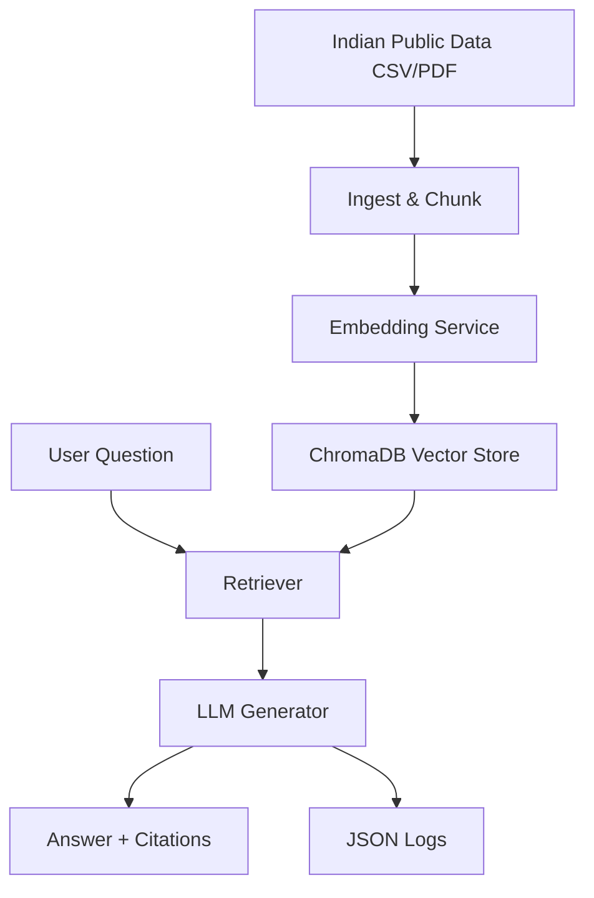

# 🇮🇳 Sovereign RAG for Indian Public Data

Build a reproducible pipeline for ingesting and querying Indian public datasets (CSV or PDF) with exact source citations.

## 🚀 Features

- **Local-first RAG**: Chunking, embedding, and storage happen locally.
- **Source Citations**: Every answer includes the exact source file and row/page number.
- **API Key Pooling**: Robust rotation and retry logic for OpenAI-compatible endpoints.
- **Indian Context**: Optimized for datasets from data.gov.in and NITI Aayog.
- **No Docker**: Simple Python environment for easy deployment.

## 🏗️ Architecture



## 🛠️ Local Development

```bash
make dev    # Create venv + install deps
cp .env.example .env # Add your OPENCODE_API_KEYS
make run    # Start Streamlit app locally
make test   # Run pytest suite
```

## 🚀 Deploy to Streamlit Cloud (Free, No Docker)

1. Push this repo to GitHub
2. Go to https://streamlit.io/cloud → "New app"
3. Connect your repo, select branch `main`
4. Set main file path: `src/api/main.py`
5. Add environment variables in Settings:
   - `OPENCODE_API_KEYS`: your comma-separated API keys
   - `CHROMA_PERSIST_DIR`: `./data/chroma` (default)
6. Click "Deploy" → get a public URL in <2 minutes

## 🚀 Deploy to Hugging Face Spaces

1. Create new Space at https://huggingface.co/spaces
2. Choose "Streamlit" template
3. Upload files or connect GitHub repo
4. In Space Settings → "Variables and secrets":
   - Add `OPENCODE_API_KEYS` as a secret
5. Click "Deploy" → public URL ready

## ⚖️ Compliance & Privacy

- **DPDP Act 2023**: This tool is intended for research and analysis purposes only.
- **Data Minimization**: Only necessary columns are ingested and stored.
- **Reproducibility**: Every query is logged with retrieved chunk hashes for auditability.

## 📝 License

Apache 2.0
